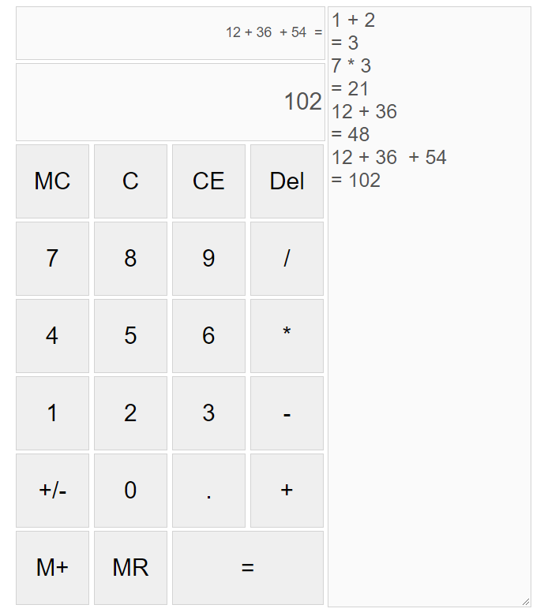

# Vanilla JavaScript Calculator

*A simple calculator written in pure JavaScript, HTML, and CSS*

Use it [here](https://kendric84.github.io/Calculator/)

## Summary
A simple calculator that allows you to perform basic calculations, see the history of your calculations, as well as save and recall a value from memoery.

Keyboard input is also supported.

## Author
- **Graham Smith** - Full-Stack Software Developer